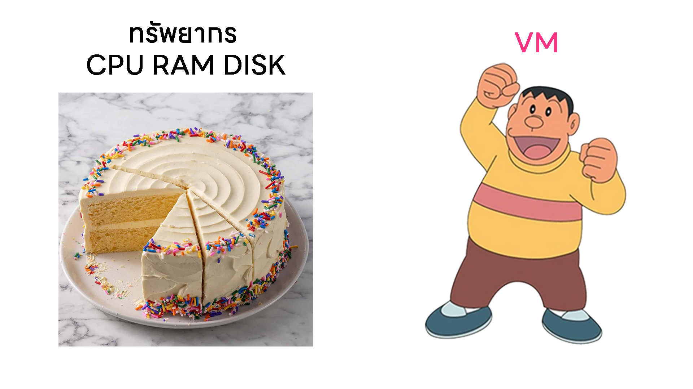
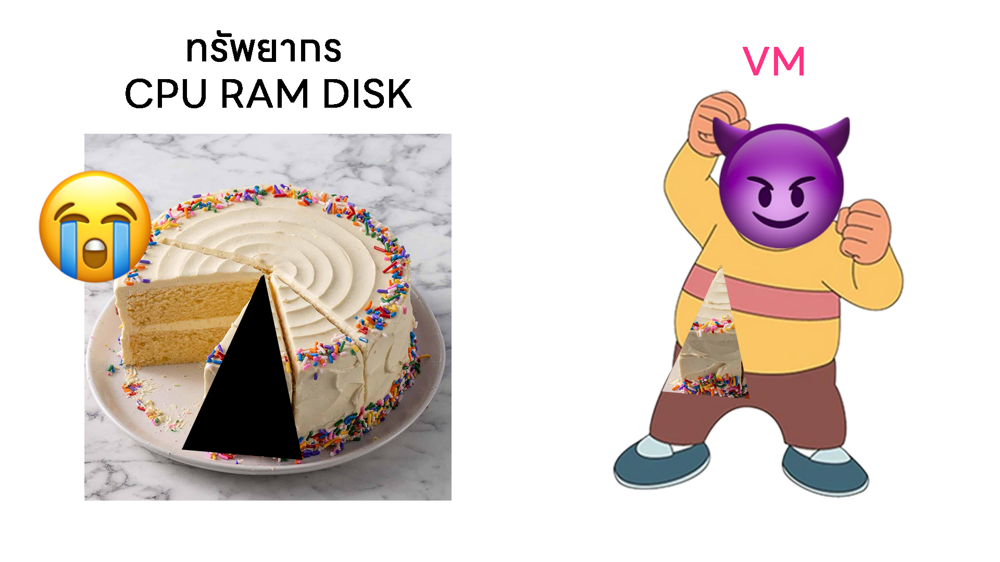
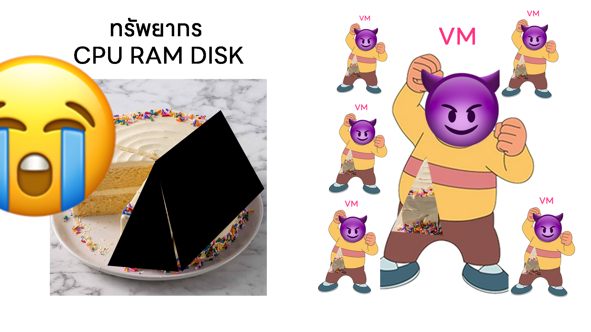
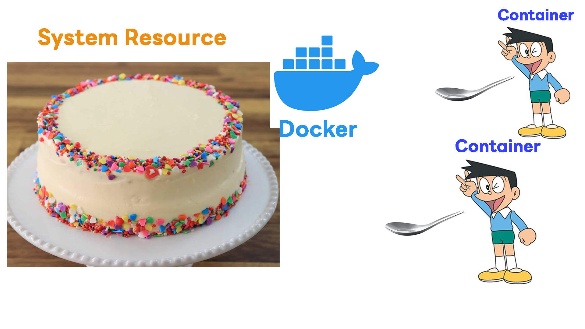

# Docker แบบโคตรง่าย ง่ายกว่านี้ไม่มีอีกแล้ว ถ้าจะเอาง่ายกว่านี้ก็เขียนเองเถอะ กูละเบื่อมึงจริงๆ

> [!WARNING]
> เนื้อหายังไม่สมบูรณ์ 100% กรุณามาช่วยเขียน จะได้มีอะไรไปอ่านสอบ

## สารบัญเนื้อหา
1. [Linux + Shell Basic](#linux--shell-basic)
2. [Install Docker](#install-docker)
3. [Understand Fundamental Docker Concepts](#understand-fundamental-docker-concepts)

## Linux + Shell Basic
เผื่อมึงไม่รู้อะไรเลยว่าอะไรคือ Shell และทำงานยังไง แต่เราน่าจะมีเครื่อง Ubuntu
- ใน Windows เราจะใช้ VirtualBox สร้าง VM Ubuntu ขึ้นมา
- ใน MacOS เราจะใช้ UTM สร้าง VM Ubuntu ขึ้นมา


และเราจะต้องใช้ Terminal ใน Windows เพื่อ SSH เข้าไปใน VM Ubuntu ของเรา

```bash
ssh ubuntu@192.168.xxx.xxx
```


สิ่งที่เราทำคือการ Login เข้าไปในเครื่อง Ubuntu ผ่านทาง SSH

SSH คือการเชื่อมต่อไปยังเครื่องอื่นผ่านทางเน็ตเวิร์ก

แต่ก่อนที่จะเข้าไปใน Docker เราจะต้องรู้จักคำสั่งพื้นฐานของ Linux + Shell ก่อน

- สิ่งที่คุณเห็นมันคือ Command Line Interface (CLI) หรือที่เรียกว่า Shell
- `ubuntu@ubuntu` คือ ชื่อผู้ใช้ (username) และ ชื่อเครื่อง (hostname)
- หลัง `$` คือ Prompt หรือ ช่องที่เราจะเอาไว้กรอกคำสั่งต่างๆ
- `~` คือ path ปัจจุบัน (current path) ซึ่ง `~` หมายถึง home directory ของผู้ใช้


คำสั่งพื้นฐานที่ควรรู้
| คำสั่ง | ความหมาย  |
|------|------|
| `ls` | แสดงรายการไฟล์ใน directory |
| `cd` | เปลี่ยน directory  |
| `pwd` | แสดง path ปัจจุบัน  |
| `mkdir` | สร้าง directory ใหม่  |
| `rm` | ลบไฟล์หรือ directory  |
| `cp` | คัดลอกไฟล์หรือ directory  |
| `mv` | ย้ายหรือเปลี่ยนชื่อไฟล์หรือ directory  |
| `touch` | สร้างไฟล์ใหม่  |
| `cat` | แสดงเนื้อหาของไฟล์  |
| `clear` | ล้างหน้าจอ terminal  |
| `exit` | ออกจาก shell หรือ terminal  |
| `history` | แสดงประวัติคำสั่งที่เคยใช้  |
| `logout` | ออกจากระบบผู้ใช้ปัจจุบัน  |
| `whoami` | แสดงชื่อผู้ใช้ปัจจุบัน  |
| `sudo` | รันคำสั่งด้วยสิทธิ์ของผู้ดูแลระบบ	|
| `apt` | ตัวจัดการแพ็กเกจสำหรับติดตั้ง ซ่อมแซม และลบโปรแกรมในระบบ Ubuntu  |
| `nano` | โปรแกรมแก้ไขข้อความใน terminal  |
| `man` | แสดงคู่มือการใช้งานคำสั่งต่างๆ	|

สมมติว่าเราต้องการสร้าง directory ชื่อ `myproject` และเข้าไปใน directory นั้น
```bash
mkdir myproject
cd myproject
```

เห็นไหมว่า path ปัจจุบันเปลี่ยนเป็น `~/myproject` แล้ว

เก่งมาก

แล้ว ถ้าเราต้องการสร้างไฟล์ชื่อ `hello.txt` และเขียนข้อความลงไปในไฟล์นั้น
```bash
nano hello.txt
```


กด `CTRL + X` เพื่อออกจาก nano แล้วกด `Y` เพื่อบันทึกการเปลี่ยนแปลง
แล้วเราจะดูว่าโฟลเดอร์ `myproject` มีไฟล์อะไรบ้าง
```bash
ls หรือ ls -l
```

แล้วเราจะดูเนื้อหาของไฟล์ `hello.txt` ได้ยังไง
```bash
cat hello.txt
```

*cat ไม่ได้มากจากคำว่าแมว มันมาจากคำว่า concatenate*
ถ้าเราต้องการลบไฟล์ `hello.txt` ล่ะ
```bash
rm hello.txt
```

ถ้าเราต้องการลบ directory `myproject` ล่ะ
```bash
cd ..  # ออกมาจาก myproject ก่อน
rm -r myproject  # ลบ myproject พร้อมกับไฟล์และโฟลเดอร์ทั้งหมดภายใน
```

*ทำไมต้องมี `-r` ด้วย*
- `-r` ย่อมาจาก recursive หมายถึงการลบโฟลเดอร์พร้อมกับไฟล์และโฟลเดอร์ทั้งหมดภายใน

Syntax ของคำสั่งต่างๆ
```bash
command [options] [arguments]
```
- `command` คือ คำสั่งที่เราต้องการใช้ เช่น `ls`, `cd`, `mkdir`
- `options` คือ ตัวเลือกเพิ่มเติมที่ปรับแต่งพฤติกรรมของคำสั่ง เช่น `-l` ใน `ls -l` ที่แสดงรายละเอียดของไฟล์
- `arguments` คือ ข้อมูลที่เราต้องการให้คำสั่งทำงานด้วย เช่น ชื่อไฟล์หรือ directory ที่เราต้องการจัดการ

นี่คือคำสั่งพื้นฐานที่เราควรรู้จักก่อนที่จะไปต่อกับ Docker

## Install Docker
```bash
sudo apt update # อัพเดตฐานข้อมูลแพ็กเกจ
sudo apt install docker.io # ติดตั้ง Docker
sudo systemctl start docker # เริ่มต้นบริการ Docker
sudo systemctl enable docker # ตั้งให้ Docker เริ่มต้นอัตโนมัติเมื่อบูตเครื่อง
sudo usermod -aG docker $USER # เพิ่มผู้ใช้ปัจจุบันเข้าไปในกลุ่ม docker ทำให้เราไม่ต้องใช้ sudo ทุกครั้งที่รันคำสั่ง docker ถ้าไม่ได้ให้เรา logout ออกจาก SSH แล้ว login ใหม่
docker --version # ตรวจสอบเวอร์ชันของ Docker
docker run hello-world # ทดสอบการรันคอนเทนเนอร์แรก
```

## Understand Fundamental Docker Concepts
ทำไมเราต้องใช้ Docker เพราะว่า Docker เกิดมาเพื่อแก้ปัญหาหลายๆ อย่าง เช่น
- เพื่อแก้ปัญหา ***มันใช้ได้บนเครื่องกู แต่ทำไมมันใช้ไม่ได้บนเครื่องมึง***
- เพื่อให้การพัฒนาและการปรับใช้แอปพลิเคชันง่ายขึ้น
- เพื่อแยกแอปพลิเคชันออกจากระบบปฏิบัติการหลัก
และนี่คือแนวคิดพื้นฐานของ Docker ที่เราควรรู้จัก

แล้ว Docker มันต่างกับ Virtual Machine (VM) ยังไง

เราต้องรู้จัก VM ก่อนว่า VM คืออะไร ทำหน้าที่อะไร
แนวคิดแบบง่ายๆ
- VM คือ โปรแกรมที่จำลองคอมพิวเตอร์ขึ้นมาอีกเครื่องหนึ่ง
- VM มีระบบปฏิบัติการของตัวเอง (Guest OS)
- VM ใช้ทรัพยากรจากเครื่องจริง (Host OS) ผ่าน Hypervisor
- แปลว่า VM แต่ละตัวจะมี OS ของตัวเอง ทำให้ใช้ทรัพยากรเยอะ

หรือมองให้เห็นภาพเหมือนมึงเป็นเด็กป.2

สมมติว่าเรามี เค้ก 1 ก้อน เป็นทรัพยากร CPU RAM DISK
การที่เราจะรัน VM 1 เครื่อง เราต้องแบ่งเค้กให้ไจแอนไปแดกเลย

แปลว่า ยิ่งมี VM มากเท่าไหร่ ยิ่งต้องแบ่งเค้กมากเท่านั้น



แล้ว Docker มันทำงานยังไงละ

สมติว่าเรามี เค้ก 1 ก้อน เป็นทรัพยากร CPU RAM DISK
การที่เราจะรัน Container 1 ตัว เราไม่ต้องแบ่งเค้กให้
แต่เรามี Docker มีหน้าที่แจกช้อนเพื่อให้ทุกคนตักเค้กจากก้อนเดียวกัน

**แปลว่า Docker Container แต่ละตัวใช้ OS ร่วมกัน ทำให้ใช้ทรัพยากรน้อยกว่า VM มาก**

> [!CAUTION]
> พึงระวังว่านี้คือการสรุปแบบง่ายๆ
> คุณควรไปอ่านเพิ่มเติมถึงความสามารถของ Docker และ VM

| Term ที่จะเจอบ่อยๆ | ความหมาย  | ความหมายแบบเด็กป.2 |
|------|------|----|
| Container | แพ็กเกจที่รวมทุกอย่างที่จำเป็นสำหรับการรันแอปพลิเคชัน | คนที่มารับเค้ก |
| Image | แม่แบบที่ใช้สร้าง Container | เค้กก้อนนึง |
| Dockerfile | ไฟล์ที่ใช้กำหนดวิธีการสร้าง Image | สูตรทำเค้ก |
| Volume | พื้นที่เก็บข้อมูลที่ใช้ร่วมกันระหว่าง Container | จานที่ใช้ตักเค้ก |
| Network | การเชื่อมต่อระหว่าง Container | โต๊ะที่ทุกคนมานั่งกินเค้กด้วยกัน |
